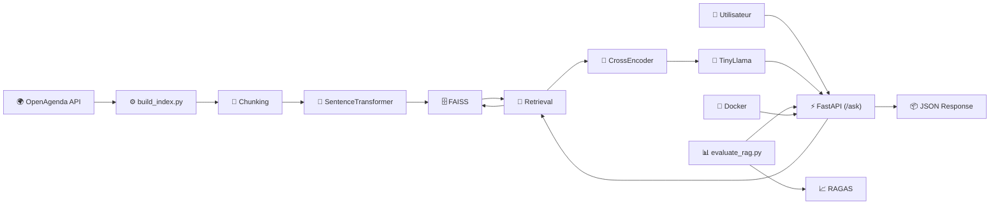
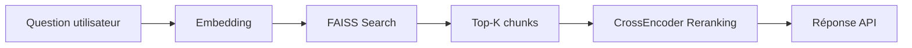

# 💻 P9-project-POC formations RAG

🔗 Liens du projet

🌐 Hugging Face Space : https://huggingface.co/spaces/amely188/P9-project-POC-formations-RAG

💻 GitHub Repository : https://github.com/masala-hadziavdic/P9-project-POC-formations-RAG.git

Table des matières

À propos du projet

Architecture

Schéma UML

Stack technique

Installation locale

Lancement de l’API

Exemple d’utilisation

Tests & qualité

Traçabilité des prédictions

CI/CD & Déploiement

Auteur

---

📖 À propos du projet

Contexte du projet

Objectif : Développer un système RAG (Retrieval-Augmented Generation) complet pour Puls-Events, une plateforme de recommandations formations.

Mission : Créer un chatbot intelligent capable de répondre aux questions des utilisateurs sur les formations en France, en s'appuyant sur les données de l'API Open Agenda.

Livrables :

- POC (Proof of Concept) pour Puls-Events, plateforme de recherche de formations
- Système RAG fonctionnel avec recherche sémantique et génération de réponses
- API exposant le système via FastAPI
- Pipeline de preprocessing complet et reproductible
- Tests unitaires avec couverture complète
- Documentation technique et rapport d'évaluation
- Conteneurisation Docker pour déploiement local

🏗️ Architecture
Utilisateur
   ↓
FastAPI (app/main.py) Endpoints: /ask, /health, /rebuild  
   ↓
SYSTÈME RAG (LangChain) : 1. Retrieval, 2. Generation
   ↓
BASE VECTORIELLE FAISS                           
│  - 16 511 vecteurs (384 dimensions)         
│  - 8 305 formations           
│  - Métadonnées complètes (titre, lieu, date, etc.)  
📂 Rôle des fichiers principaux
## Architecture technique

| Composant | Technologie / Modèle | Version | Rôle |
|------------|----------------------|----------|-------|
| Données | OpenAgenda API | - | Source des événements/formations |
| Prétraitement | Pandas | 2.x | Nettoyage et structuration des données |
| Chunking | RecursiveCharacterTextSplitter | LangChain 0.3.x | Découpage des descriptions en chunks de 500 caractères avec overlap de 50 |
| Embeddings | paraphrase-multilingual-MiniLM-L12-v2 | Sentence-Transformers | Vectorisation sémantique des textes |
| Dimension des embeddings | 384 dimensions | - | Représentation vectorielle de chaque chunk |
| Nombre de chunks indexés | 16 511 | - | Documents vectorisés dans FAISS |
| Base vectorielle | FAISS IndexFlatL2 | 1.9.x | Recherche sémantique par similarité |
| Re-ranking | cross-encoder/ms-marco-MiniLM-L-6-v2 | Sentence-Transformers | Réordonnancement des résultats récupérés |
| LLM | TinyLlama/TinyLlama-1.1B-Chat-v1.0 | Transformers | Génération de réponses en langage naturel |
| Framework RAG | LangChain | 0.3.x | Orchestration Retrieval-Augmented Generation |
| API REST | FastAPI | 0.115.x | Exposition des endpoints |
| Serveur ASGI | Uvicorn | 0.34.x | Exécution de l'API |
| Évaluation | RAGAS | 0.1.x | Évaluation automatique du système RAG |
| Tests | Pytest | 8.x | Tests unitaires et fonctionnels |
| Conteneurisation | Docker | latest | Déploiement reproductible |
| Gestionnaire de dépendances | uv / pip | latest | Installation des packages |

🗄️ Architecture du système RAG




⚙️ Stack technique & versions
Technologie	Version
Python	3.12
FastAPI	0.104+
Pandas	2.3+
NumPy	2.3+
GitHub Actions	CI/CD
Hugging Face Spaces	Déploiement
## 💾 Installation locale
# Cloner le repository
```
git clone https://github.com/masala-hadziavdic/P9-project-POC-formations-RAG.git
cd C:\Users\amela\P9-project RAG

# Créer environnement virtuel
python -m poetry

# Installer dépendances
pip install --upgrade pip
pip install -r requirements.txt
```

```
### Endpoints API

| Endpoint | Méthode | Description |
|-----------|----------|-------------|
| `/` | GET | Vérification de l'API |
| `/health` | GET | État de santé et taille de l'index |
| `/ask` | POST | Recherche de formations via le système RAG |
| `/rebuild` | POST | Reconstruction de l'index FAISS |


```
uvicorn app.main:app --reload
```

Documentation Swagger disponible à :

http://127.0.0.1:8000/docs

📬 Exemple d’utilisation
```json
POST /predict
{
  "question": "Quelles formations dans le BTP à Paris ?"          
}
```
```### Exemple

**Input utilisateur**

> Quelles formations dans le BTP à Paris ?

**Chunks récupérés**

1. Présentation des formations du GRETA METEHORS PARIS...
2. Venez découvrir les formations dans le BTP...
3. Découvrez les formations BTP avec ECF...

**Réponse renvoyée**

- Présentation des formations du GRETA METEHORS PARIS
- Venez découvrir les formations dans le BTP
- Découvrez les formations BTP avec ECF

**Score de confiance**

0.98
```


## 🧪 Tests & Couverture

Une suite complète de tests unitaires et fonctionnels a été développée avec Pytest pour garantir la robustesse de model.

Les tests couvrent :
- Le bon fonctionnement des endpoints API
- La validation des données via ragas
- Les cas d’erreurs (champs manquants, Service non disponible → 503)
- Le chargement du modèle 

📊 **Rapport de couverture de tests :**


## 📊 Traçabilité des prédictions

| Élément | Description |
|----------|-------------|
| Input utilisateur | Question posée par l'utilisateur |
| Embedding de la question | Vectorisation de la question avec `paraphrase-multilingual-MiniLM-L12-v2` |
| Recherche vectorielle | Recherche des Top-K chunks les plus similaires dans FAISS |
| Re-ranking | Réordonnancement des résultats avec `cross-encoder/ms-marco-MiniLM-L-6-v2` |
| Contextes récupérés | Chunks utilisés pour construire la réponse |
| Réponse finale | Liste des formations recommandées renvoyée par l'API |
| Score de confiance | Score calculé après le reranking |

🔁 CI/CD & Déploiement

Pipeline GitHub Actions :

Exécution des tests

Vérification du chargement FastAPI

Déploiement automatique vers Hugging Face Space

Déploiement automatique vers :

👉 https://huggingface.co/spaces/amely188/P9-project-POC-formations-RAG

👩‍💻 Auteur

Support et contact
Auteur : masala-hadziavdic (amela188@hotmail.com)
Projet : Formation Data Scientist Machine Learning - OpenClassrooms
Repository : GitHub
Démo live : Hugging Face Spaces
Projet réalisé dans le cadre POC formations RAG